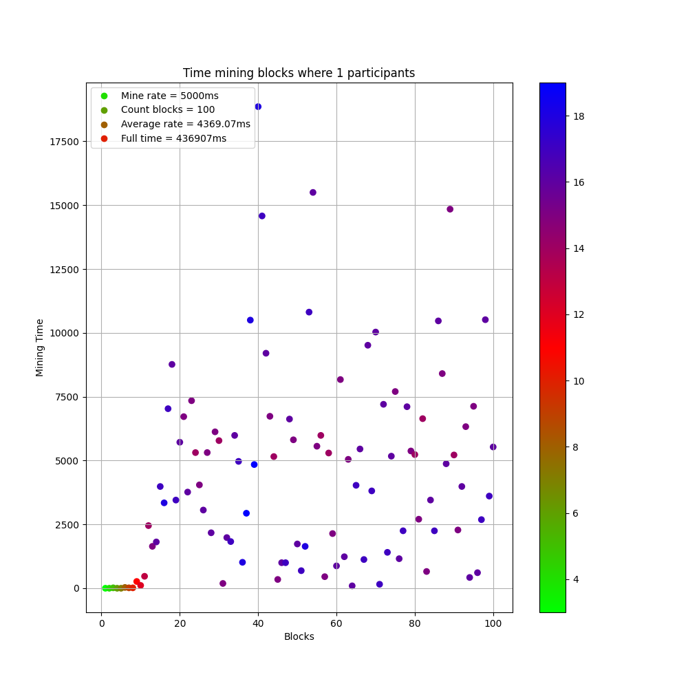
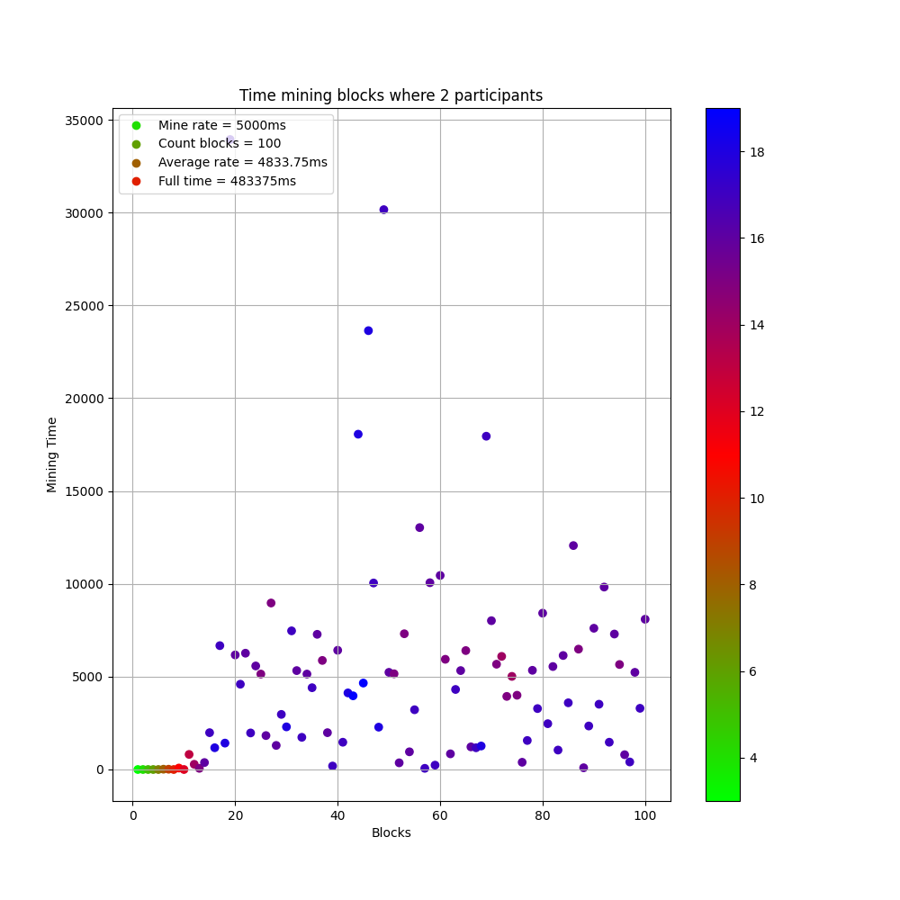
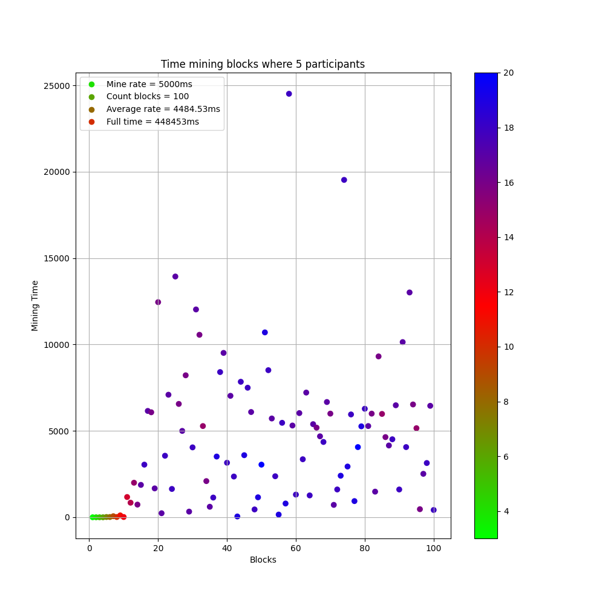
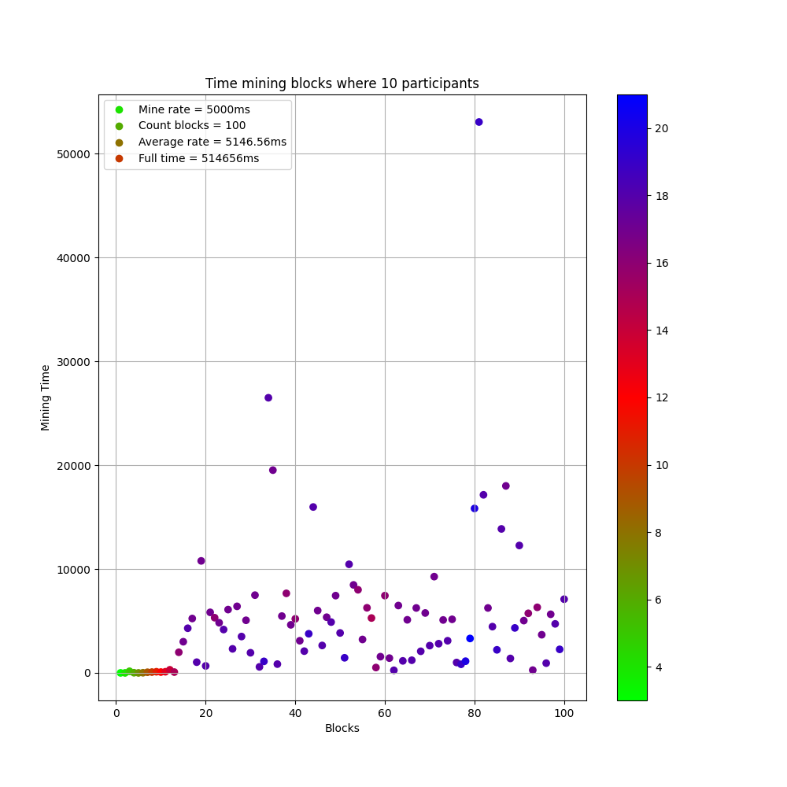
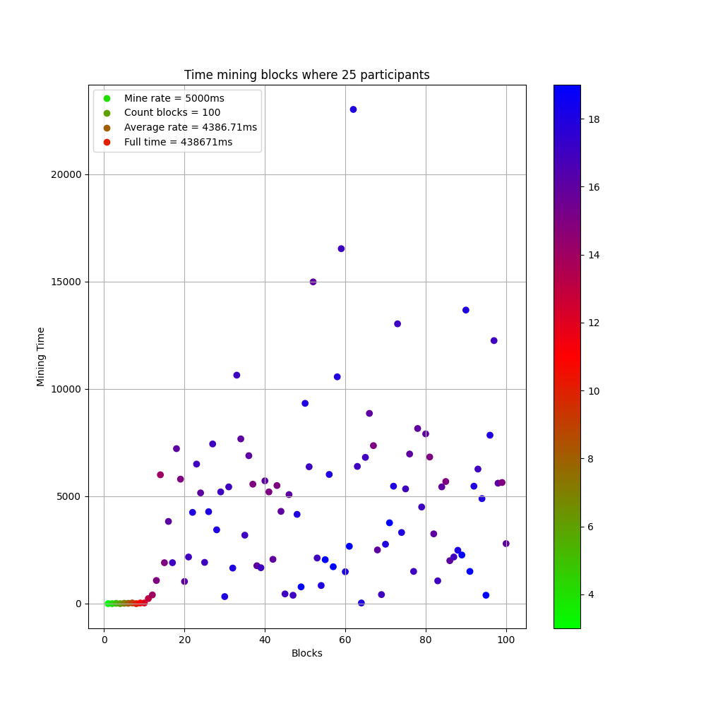
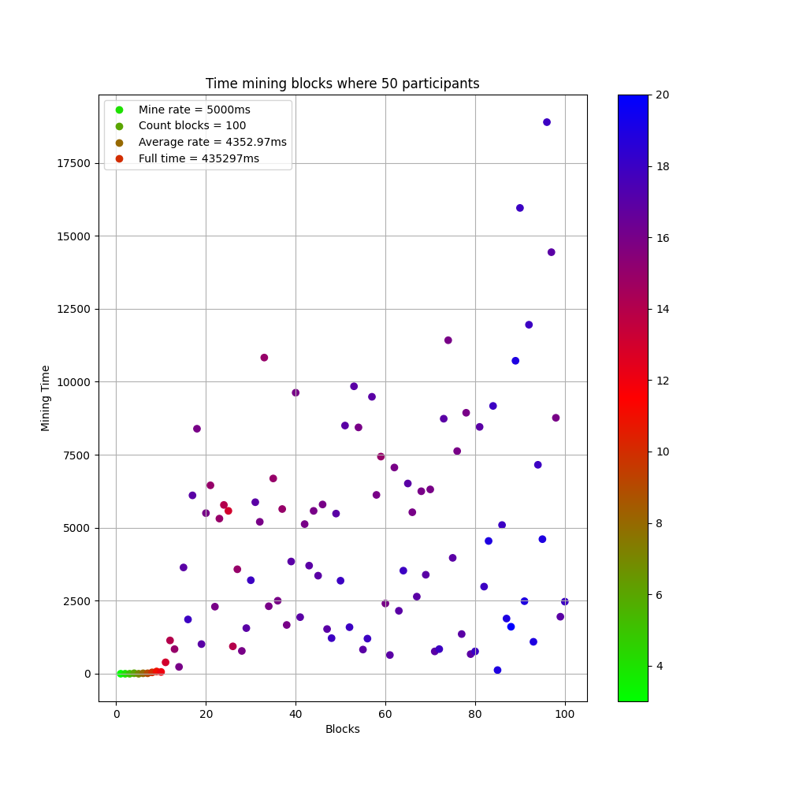
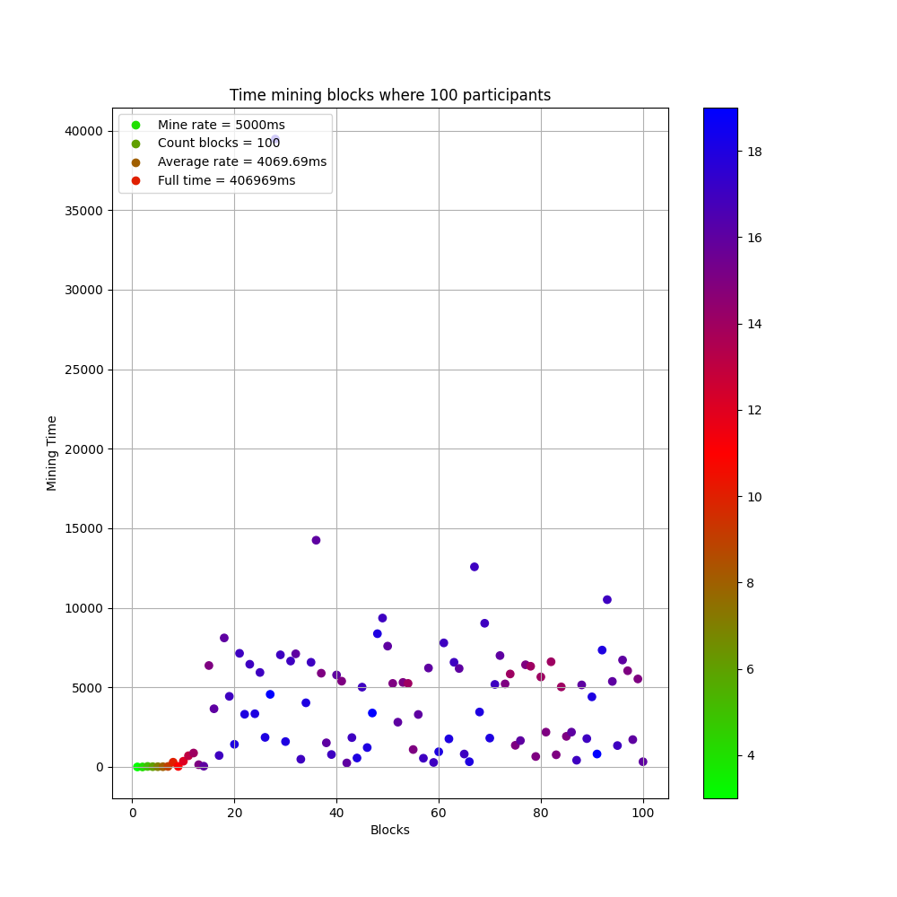
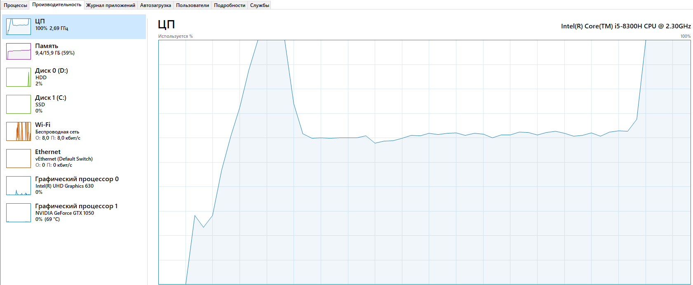

# Диплом

## Тема: "Анализ зависимости скорости роста блокчейна и сложность сети от кол-во участников"

### Характеристики ноутбука

- Intel(R) Core(TM) i5-8300H CPU @2.30GHz
- 16 гигов памяти DDR4

### Описание

**Что сейчас сделано?**

- Реализован код который **"эмулирует"** участников блокчейна используя многопроцессорный запуск на локальной машине.
- Было проведено тестирование с **mine rate** = **5s** и кол-во участников: 1, 2, 5, 10, 25, 50, 100.

Ниже на графиках можно будет увидеть результаты тестирования. Левая шкала обозначает **difficulty**_(сложность)_.

## Промежуточные выводы

Как можно заметить для 1-процессорного(1 участник) режима среднее время, да и вообще время неплохое, 
это потому что нам не приходится тратить "ресурсы" на проверку результатов майнинга других Blockchain. 

Именно поэтому разница при **1 vs 2** участниках достаточно внушительная. При этом можно заметить, 
что при **2 vs 5** мы уже видим, что время начинает улучшаться т.к тут уже влияет общая **"вычислительная мощность"** системы.

Очень интересный факт замечается при сравнение **5 vs 10** участников. Время РЕЗКО ухудшается. Есть подозрение это из-за 
совпадения неудачных параметров т.е прирост участников дал в данном случае не прирост **"вычислительная мощности"**, 
а больше накладных расходов на проверки.  _(или проблема компьютера, но данный тест был проведен 3 раза и всегда время было подобным)_

Это недоразумение исправляется при сравнение **5 vs 10 vs 25** участников, мы видим, 
что мы получили заметную эффективность сравнимую с 1 процессорным режимом. 

Следующий шаг дает незначительный прирост кпд **25 vs 50**. Опять же скорее всего из-за возросших накладных расходов.

Последний тест при 100 участников показывает, что **"вычислительная мощность"** системы делает свое дело и мы видим наилучший результат.

### Небольшие наблюдения

- Можно заметить, что с возрастанием кол-во участников сети, у нас все меньше "выбросов", которые значительно выше mine rate.

Ниже на картинке изображена как выглядит нагрузка, при локальном запуске:
